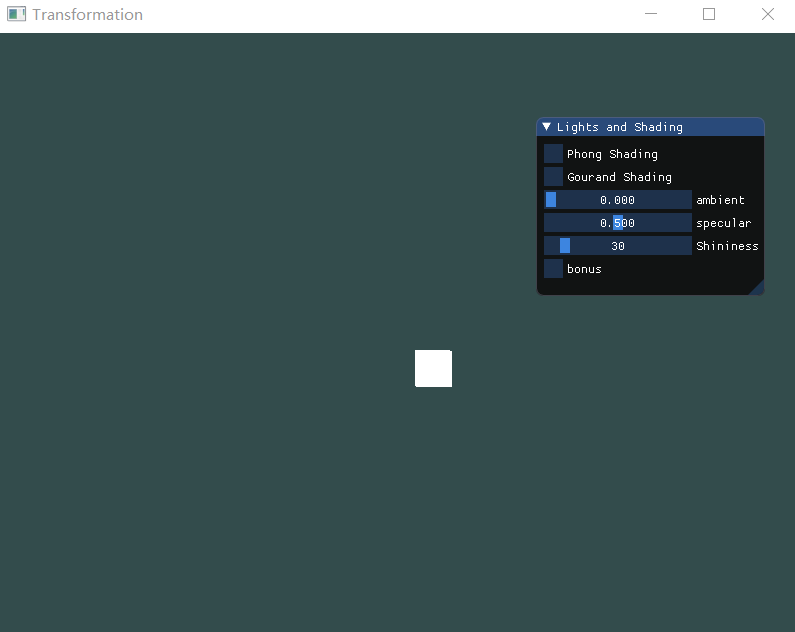
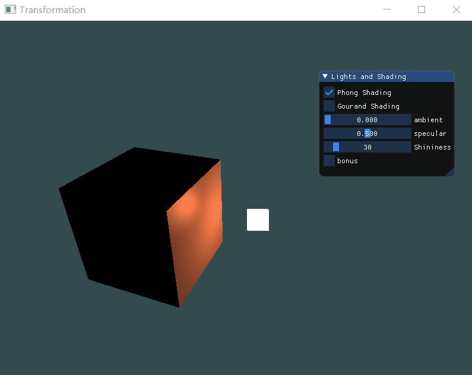
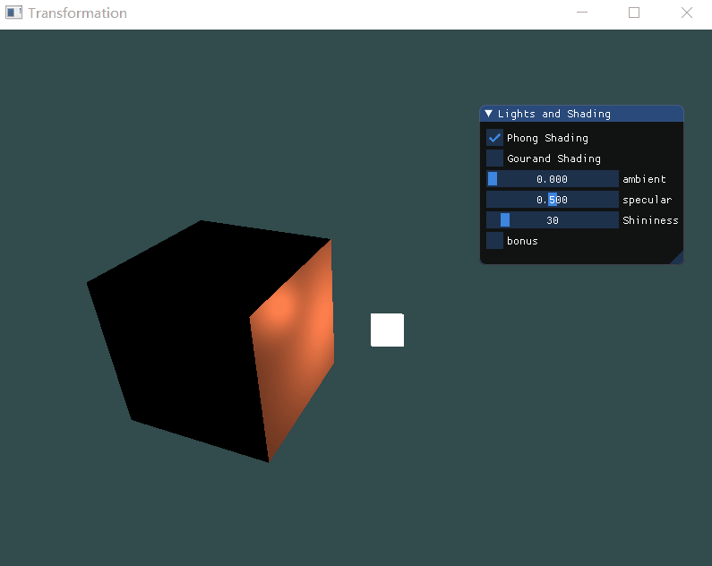
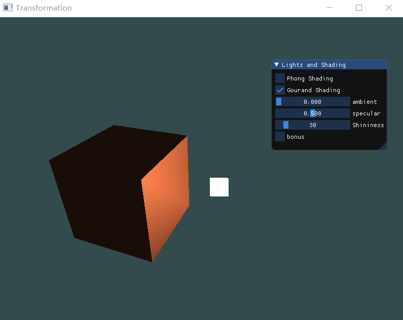

# 计算机图形学HW6
姓名：陈谱一    学号：16340026
## Basic:
1. 实现Phong光照模型：
- 场景中绘制一个cube
- 自己写shader实现两种shading: Phong Shading和Gouraud Shading，并解释两种shading的实现原理 
- 合理设置视点、光照位置、光照颜色等参数，使光照效果明显显示

实现光照效果需要两个立方体，一个作为光源，另一个是被光照的物体。题目要求实现两种shading，故物体部分需要完成两个着色器，光源需要完成一个着色器。

Phong光照模型主要结构由环境、漫反射和镜面三个分量组成：
- 环境光照常量会永远给物体一些颜色，所以即时在完全黑暗的情况下也可以看到物体。
- 漫反射光照模拟光源对物体的正向性影响，物体的某一正对光源的部分会更亮。
- 镜面反射模拟了光泽物体上的两点，因此颜色会更倾向于光的颜色。

**环境光照**

环境光照的主要思想是把一个很小的光照颜色添加到物体片段的最终颜色中，实现过程非常简单，即用光的颜色乘一个常量再乘物体的颜色即为最后的颜色：
```
vec3 ambient = ambientStrength * lightColor;
vec3 result = ambient * objectColor;
```
ambientStrength的值可以根据实际情况进行设定，范围一般是0-1之间。

**漫反射光照**

漫反射光照使得物体上和光线方向接近的片段可以获得更多的亮度。方法是使用一个法向量，通过两个向量之间的点击来计算亮度。当两个向量夹角为90度时，点乘为0，光对片段的影响就非常小。在顶点着色器中增加一个normal变量并传给片段着色器：
```
FragPos = vec3(model * vec4(aPos, 1.0));
Normal = mat3(transpose(inverse(model))) * aNormal;  
gl_Position = projection * view * vec4(FragPos, 1.0);
```
然后在片段着色器中计算漫反射分量，首先计算光源和片段位置的方向向量，通过两个向量相减得到，注意要转换成单位向量。然后对norm和lightDir进行点乘，计算光源对当前片段的漫反射影响，最后的结果再乘光的颜色得到漫反射分量：
```
vec3 norm = normalize(Normal);
vec3 lightDir = normalize(lightPos - FragPos);
float diff = max(dot(norm, lightDir), 0.0);
vec3 diffuse = diff * lightColor;
```

**镜面光照**

通过反色和法向量周围光的方向来计算反射向量，然后计算反射向量和视线方向的角度差，角度差越小镜面光影响越大。首先定义一个镜面强度变量，下一步计算视线方向向量和沿着法线轴的反射向量，最后计算镜面分量：
```
vec3 viewDir = normalize(viewPos - FragPos);
vec3 reflectDir = reflect(-lightDir, norm);  
float spec = pow(max(dot(viewDir, reflectDir), 0.0), Shininess);
vec3 specular = specularStrength * spec * lightColor;  
```

在上述三个步骤都完成之后，得到ambient、diffuse和specular三个变量的值，最后的结果是三者相加和颜色相乘：
```
vec3 result = (ambient + diffuse + specular) * objectColor;
FragColor = vec4(result, 1.0);
```

Gouraud Shading和Phong Shading最大的不同是Gouraud Shading是在顶点着色器中实现冯氏光照模型，这样可以用到更少的顶点，所以会更加高效，且计算频率更低。缺点是颜色值只是顶点的颜色而不是片段的颜色，所以看起来不真实。二者的比较如下图：



2. 使用GUI，使参数可调节，效果实时更改： 
- GUI里可以切换两种shading 
- 使用如进度条这样的控件，使ambient因子、diffuse因子、specular因子、反光度等参数可调节，光照效果实时更改

添加GUI如下：
```
{
	ImGui::Begin("Lights and Shading");
	ImGui::Checkbox("Phong Shading", &pShading);
	ImGui::Checkbox("Gourand Shading", &gShading);
	ImGui::SliderFloat("ambient", &ambientStrength, 0.0f, 0.6f);
	ImGui::SliderFloat("specular", &specularStrength, 0.0f, 1.0f);
	ImGui::SliderInt("Shininess", &Shininess, 10, 200);
	ImGui::Checkbox("bonus", &bonus);
	ImGui::End();
}
```
Shading之间的转换如第一题图。通过改变相关因子的值来更改光照效果：



## Bonus:

- 当前光源为静止状态，尝试使光源在场景中来回移动，光照效果实时更改。 

这一部分的实现通过加一个判断即可完成，使光源绕着物体旋转：
```
if (bonus) {
	float y = sin((float)glfwGetTime())*0.8f;
	float z = cos((float)glfwGetTime())*0.8f;
	lightPos = glm::vec3(-1.0f, y, z);
}
else {
	lightPos = glm::vec3(0.0f, 0.0f, 1.0f);
}
```
Phong Shading结果如下:



Gouraud Shading结果如下：



可以明显看到Gouraud Shading的光照效果不如Phong Shading真实。